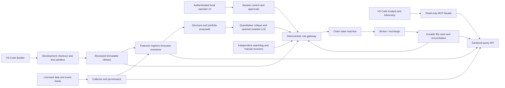

# NIFTY Local Agent Platform Implementation Plan

> **For agentic workers:** Use superpowers:subagent-driven-development or superpowers:executing-plans when available to implement this plan task-by-task. Treat each milestone as a separate reviewable work package. Do not interpret the roadmap as authorization to connect a live account, arm trading, or deploy an unvalidated strategy.

**Goal:** Build a local NIFTY 50 index-options research and trading service, supervised through GitHub Copilot in VS Code, that can eventually buy and sell only through a deterministic, independently enforced risk gateway.

**Architecture:** VS Code is the interactive research/development console, not the trading scheduler. An independent local runtime owns data, forecasts, portfolio state, risk decisions, execution and exits. A restricted read-only MCP facade supplies verified runtime evidence to the VS Code agents; an independently authenticated local operator interface controls arming and live approvals.

**Tech Stack:** Python 3.12-compatible pinned packages, FastAPI/Pydantic, PostgreSQL/SQLAlchemy/Alembic, Parquet/Polars/DuckDB, scikit-learn/LightGBM, QuantLib, pytest/Hypothesis, Streamlit, supported broker SDK, optional provider LLM SDK, Windows/WSL2 and later Compose. No Kubernetes, no reinforcement learning and no mandatory GPU.

**Date:** 2026-09-17.

**Status update:** A separately requested bounded public-snapshot paper prototype is now implemented; see [paper usage](../../PAPER-TRADING.md) and [prototype scope](../../PAPER-RUNNER-DESIGN.md). This does not complete the master milestones: no licensed feed, calibrated model, production risk service, MCP integration or broker execution exists. No edge is demonstrated and no live account is configured. Sections below are the master target architecture unless explicitly identified as implemented in the prototype documentation.

---

## 1. Non-negotiable design decisions

1. Tradable allowlist: exchange-identified NIFTY 50 index options only. Futures, constituents, VIX, currencies and other indices may be observed but never traded by this service.
2. Default mode is RESEARCH. Missing mode/configuration never defaults to PAPER or LIVE.
3. Initial tradable research scope: intraday long calls/puts; same-expiry debit verticals only after legging safety is validated. No naked shorts, ratios, calendars, overnight positions or expiry-day live trading initially.
4. Investigate 15/30/60-minute forecasts, make decisions on completed one-minute bars, manage risk on every relevant event. Do not confuse collection frequency with profitable trading frequency.
5. Every opportunity competes with CASH. Abstention is a successful outcome.
6. Statistical models produce probabilities and scenarios. Pricing and risk software determine feasible quantities and orders. LLM prose never becomes an order payload.
7. Every submit, replace, cancel and close action enters an authenticated gateway. Entry versus risk-reducing actions have different policies; protective exits do not require the LLM or fresh entry approval.
8. Broker credentials exist only in a separately isolated runtime identity. They must not be inherited by VS Code, the build/test process, model prompts, MCP, logs or research containers.
9. Agent instructions and tool lists guide/restrict a chat session; they are not a security boundary against an OS administrator, another agent, changed settings or arbitrary terminal code.
10. Live artifacts and policies are immutable versioned releases installed by an authorized operator outside the writable development checkout. No hot reload from source edited by an AI.
11. No promises of daily profit, guaranteed stops, guaranteed fills or immunity to catastrophic operational failures.

## 2. What selecting an agent actually does

### Available with this documentation pack

- NIFTY Analyst: reads the plan and evidence supplied as non-secret project files; fetches cited public documents for contextual research; reports unavailable live data explicitly.
- NIFTY Adversary: reviews immutable evidence/proposal reports and looks for contradictions, timing errors, costs and unbounded execution states.
- NIFTY Builder: implements an explicitly requested milestone in the development checkout; writes/runs tests with synthetic, replay or paper adapters only.

Selecting any of these agents does NOT start a daemon, subscribe to exchange data, continuously monitor markets, or place orders. The currently selected Copilot model is used; no paid model name is hard-coded.

### Target experience after implementation and validation

1. Operator starts local services; runtime starts DISARMED and reconciles state.
2. Operator selects RESEARCH, PAPER, HUMAN_APPROVED_LIVE or CONTROLLED_LIVE through the local control interface.
3. Analyst requests a fresh runtime snapshot through an explicitly allowlisted read-only MCP tool.
4. Runtime independently computes forecasts, structure economics and proposed exits.
5. Quantitative adversarial checks run; any required LLM critique completes before a fresh entry proceeds.
6. In HUMAN_APPROVED_LIVE, the operator signs a fresh proposal in the local UI. A message such as "yes" in Copilot chat is not this authorization.
7. Risk gateway revalidates prices, account state, policy, critique and approval, reserves capacity atomically, then permits execution.
8. Runtime monitors confirmed fills and manages exits even when the chat is closed.
9. Analyst can explain current evidence and reconcile reported actions to runtime IDs.

### Two ways to obtain reasoning

- **VS Code Copilot:** interactive analyst and engineering assistant. Do not scrape its UI, extract its access tokens or assume a subscription supplies an unattended inference API.
- **Optional unattended reasoning:** separately configured OpenAI/Gemini or local model adapter, with explicit cost/privacy limits. This is separate authentication/billing and must never receive broker credentials.

If required reasoning is unavailable, skip new entries. Existing risk management remains deterministic. An alternative policy without a required LLM critique would need separate validation and approval, not an outage-time bypass.

## 3. Process and trust-boundary diagram

No trade-capable MCP server is exposed to Copilot. The builder has no production identity. A local MCP stdio process may terminate with VS Code; it is a facade, not the runtime supervisor.

## 4. Inputs required before external integration

Do not ask for any passwords, tokens or API keys in chat.

| Input | Decision needed | Blocked milestone if absent |
|---|---|---|
| Broker | Name, supported API, order/status/margin semantics, permitted products | Live/paper integration against real broker data |
| Data source | Licensed real-time depth and historical quote coverage, timestamp meaning | Credible executable backtest |
| Capital | Account equity and available risk capital, without account identifiers | One-lot feasibility and live sizing |
| Personal loss tolerance | Maximum acceptable daily/weekly/drawdown budget | Live policy sign-off |
| Hardware | RAM/storage, WSL2 availability, uptime, UPS/network backup | Deployment and resilience targets |
| Trading scope | Intraday only initially; approved structures and hours | Strategy release |
| Reasoning choice | Copilot interactive only, separate API or local model | Unattended critique |
| Compliance | Broker/exchange/SEBI requirements applicable to this arrangement | Any live API activation |

The first development milestone needs none of these secrets and can use synthetic data.

## 5. Target modules and ownership

The following source paths are implementation targets, not currently existing code.

| Planned module | Responsibility |
|---|---|
| `src/nifty_platform/contracts/` | Typed modes, money, lots, timestamps, instrument identity and event schemas |
| `src/nifty_platform/reference/` | Effective-dated instruments, calendars, lot/tick/freeze values and fees |
| `src/nifty_platform/data/` | Feed adapters, immutable events, normalization and quality |
| `src/nifty_platform/features/` | Shared causal offline/online feature functions |
| `src/nifty_platform/regimes/` | Direction/volatility/context states and uncertainty |
| `src/nifty_platform/forecasts/` | Return distributions, variance models and calibration |
| `src/nifty_platform/pricing/` | Forward extraction, surfaces, IV/Greeks and price bounds |
| `src/nifty_platform/scenarios/` | Joint underlying/IV/skew/liquidity path scenarios |
| `src/nifty_platform/strategies/` | Registered hypotheses and entry/exit contracts |
| `src/nifty_platform/portfolio/` | Integer allocation, overlapping risk and scenario aggregation |
| `src/nifty_platform/risk/` | Policies, atomic reservations, permits and halt state |
| `src/nifty_platform/execution/` | Intent/outbox, broker adapters, partial fills, cancellation and recovery |
| `src/nifty_platform/ledger/` | Append-only fills/cash, positions and reconciliation |
| `src/nifty_platform/backtest/` | Event clock, quote replay and conservative fill simulation |
| `src/nifty_platform/research/` | Trials, purged splits, costs, scoring and release evidence |
| `src/nifty_platform/reasoning/` | Sourced facts, critique schema and isolated provider adapters |
| `src/nifty_platform/api/` | Separate read-only query and authenticated operator controls |
| `src/nifty_platform/mcp/` | Read-only evidence tools, no arbitrary SQL/HTTP/shell |
| `src/nifty_platform/runtime/` | Session state machine, scheduling and liveness |
| `src/nifty_platform/autopsy/` | Trade episodes, attribution, skipped proposals and failure taxonomy |
| `tests/unit/`, `tests/integration/`, `tests/replay/`, `tests/security/` | Test layers with isolated fixtures |

Use one repository and a few independent processes, not one network service for every folder. No Redis initially; add it only as a rebuildable cache if profiling justifies it.

## 6. Data and evidence contracts

### Identity and timing

- Canonical instrument IDs are independent of broker tokens; mappings have validity intervals.
- Snapshot includes `snapshot_id`, `schema_version`, `exchange_ts`, `received_at`, `available_at`, `source_id`, `quality_flags`, `input_hash`, `is_synthetic` and quote-age metadata.
- UTC internally; IST for operator display. Every point-in-time join enforces `available_at <= decision_time`.
- Do not claim broker snapshots are a complete exchange tick stream. Preserve documented feed limitations.
- Index spot has no traded volume/VWAP. Futures volume/VWAP are labelled as futures features.

### Initial collection policy

- Record all received events for held/working instruments, liquid candidate options and relevant futures.
- Produce one-second execution/risk snapshots and completed one-minute features.
- Observe slower OI changes only when genuinely updated; store their age.
- Capture breadth from point-in-time constituents/weights, with missing-coverage flags.
- Keep current instruments, holidays, expiry times, fees and broker product policies effective-dated.
- Retain immutable raw data in Parquet and dataset manifests; use PostgreSQL for state/lineage.
- Expand strike subscriptions deterministically; preserve what was actually subscribed when a proposal was made.

### Quantitative output contracts

- `Forecast`: ID, model/release/data hashes, decision time, horizon, ordered quantiles, coherent probabilities, realized-variance estimate, model uncertainty and valid-until.
- `ScenarioSet`: underlying paths, IV/skew changes, spread/depth states, weights, scenario version and stress flag.
- `Proposal`: ID/hash, snapshot/forecast/scenario IDs, strategy version, legs, integer lots, entry envelope, exit-policy ID, expiry, net EV and conservative lower bound.
- `Critique`: proposal hash, source IDs, numerical checks, contradictions, unresolved items, completion time, model/prompt version if LLM used.
- `RiskPermit`: exact order-payload hash, policy/release ID, portfolio version, reservation ID, maximum quantity/price envelope, action type, expiry and authenticated integrity protection.
- `OrderIntent`: immutable client intent, permit reference, instrument, side, exact units, state and broker correlation metadata.
- `Fill`: unique trade identity, broker/exchange order IDs, instrument, quantity, price, execution/receive time and fees.

Reject schema violations, incoherent units, unknown releases and missing evidence rather than guessing.

## 7. Market-analysis and buy/sell decision loop

### Pre-open

1. Refresh sessions, instruments, lot/tick/freeze values and fees from authoritative sources.
2. Verify data entitlement, connectivity, clock, disk, database, approved releases and alerts.
3. Reconcile all broker positions/orders/funds, including manual trades. Unexpected activity halts new entries.
4. Load scheduled NIFTY-relevant events and source timestamps.
5. Operator confirms session scope through local UI; no chat-based auto-arming.

### Each completed minute

1. Confirm all required data is fresh, causally available and sufficiently synchronized.
2. Compute price/volatility/breadth/basis/IV/context features with the same functions used in replay.
3. Infer direction, volatility and event/abnormal regimes; retain uncertainty rather than inventing certainty.
4. Forecast 15/30/60-minute underlying distributions and realized variance. Suppress unavailable full horizons near close.
5. Produce joint spot/IV/skew/liquidity scenarios and relevant tail shocks.
6. Let approved strategy contracts propose opportunities; never ask an LLM to pick the side from prose.
7. Enumerate liquid long options and approved same-expiry debit verticals; compare expiries, ATM/ITM/OTM, costs, adverse paths and cash.
8. Estimate scenario net P&L using executable entry and exit assumptions; include fees once and bid/ask once.
9. Reject candidates whose conservative EV is nonpositive or whose minimum lot fails risk budgets.
10. Apply quantitative objections and required sourced critique. Timeout/missing evidence means no new trade.
11. If needed, obtain fresh human approval bound to the exact proposal and price envelope.
12. Risk engine independently recomputes feasibility, reserves capacity and authorizes the exact action.
13. Execute and record broker-confirmed outcomes. Expired proposals are discarded, not replayed after reconnection.

### While positions exist

- Risk/monitoring is event-driven, with an initial one-second watchdog cadence. Exact thresholds must be verified against feed behavior.
- Compare executable P&L, scenario exposure, stop/thesis/time criteria and broker state to the approved exit policy.
- Sell confirmed long option quantities to close; never sell an invented or merely requested quantity.
- For spreads, close short exposure before releasing corresponding long protection.
- Protective exits do not wait for a chat message, LLM completion or repeated human approval.
- A partial exit leaves an active position. Cancel pending requests are not final cancellations.
- Recompute residual risk after each fill; latch entry halt on unknown or inconsistent state.

### Session close

- Initial normal-session policy: entries 09:30–14:30 IST, start closing by 15:10, target confirmed flat by 15:15 or earlier broker cutoff. Calendar and broker restrictions take precedence.
- If still exposed, alert and follow the documented failure/overnight-contingency procedure; do not report flat prematurely.
- Reconcile orders, trades, charges and cash; create daily evidence and trade-autopsy reports.

## 8. Forecasting and research scope

Initial features: normalized returns at a small set of horizons, trailing realized variance, futures relative volume and VWAP distance, opening range only after completion, breadth/contribution concentration, synchronized basis, ATM IV/skew/term structure, time to expiry, time of day and event flags.

Model ladder:

1. Zero-mean/time-of-day volatility and historical conditional distribution baselines.
2. Regularized logistic threshold probabilities, ridge mean model, EWMA/HAR variance and fat-tailed residuals.
3. Shallow LightGBM quantile/bin models with validation-only calibration and coherent probability checks.
4. HMM/temporal models only if additional out-of-sample net evidence justifies their complexity.

First strategy families: breadth-supported continuation, regime-conditioned futures-VWAP reversion, completed opening-range continuation/failure and directional signals filtered by option attractiveness. These are hypotheses, not claimed edges.

Physical forecast probabilities drive expected P&L. Risk-neutral implied probabilities price contracts and are not substitutes for real-world probabilities. Terminal inside-range probability is not a pathwise never-breached probability.

Every experiment records its hypothesis, data availability, trial count, complete parameter search, split definitions, costs, random seed, hashes and rejection criteria. Use purged chronological validation; purge overlapping label intervals, fit transforms within training and use dependence-aware embargo where warranted. Keep one untouched holdout, then sequential paper/live validation. Do not reuse a failed holdout as proof for a redesigned strategy.

## 9. Initial risk policy and account feasibility

These defaults are conservative engineering starting points, not personalized advice or guaranteed maximum realized losses. The operator may tighten them. Relaxation requires a new validated policy release.

| Policy | Starting value/action |
|---|---|
| Per-idea maximum loss budget | 0.25% of conservative equity |
| Aggregate open/reserved loss budget | 0.75% |
| Daily loss trigger | 1.0% of start-of-day equity including costs/unrealized loss |
| Weekly trigger | 2.0% then review pause |
| Drawdown response | Half risk at 3%; pause at 5% from cash-flow-adjusted high-water |
| Consecutive losing ideas | Three, then stop new entries for session |
| Concurrent structures | One initially |
| Minimum/initial quantity | One whole lot only if it fits every budget |
| New ideas | At most six per session initially |
| Cash/margin usage | At most 50% after reserved amounts and broker requirements |
| Naked shorts | Forbidden |
| Order rate | Entry/modify cap below broker limit; initially 1/second, 10/minute |
| Recovery traffic | Separate bounded priority for cancel/reduce; broker limits always apply |
| Quote age for entry | Initial maximum one second on selected liquid instruments; validate feed suitability |
| Spread for entry | Initial maximum 1% of premium mid, plus total cost/EV check |
| LLM-required critique missing | Reject/expire new entry; do not disable exits |

For a long option, loss budget uses full premium plus conservative costs, not its stop distance. For a vertical, reserve for the worst permitted full and partial-fill state, including the long leg alone. Integer sizing is floored; if the result is zero, stay in cash. No martingale, averaging down or "recovery" trades outside the fixed policy.

Aggregate Greeks with explicit units: rupee delta and gamma P&L for a 1% underlying move, vega per one volatility percentage point, theta per day. Track gross and net values. Reprice full positions for large shocks and near expiry.

Stress spot ±0.5/1/3/5/10%, IV ±5/15 percentage points, skew shifts, spread widening, depth disappearance, delayed exits, failed legs, exchange halts and involuntary overnight carry. A finite grid does not prove a bound; use analytic structure loss and operational failure analysis as well.

## 10. Execution, ledger and crash consistency

State graph: CREATED → RESERVED → SUBMITTING → ACKNOWLEDGED → OPEN/PARTIAL → FILLED/CANCELLED/REJECTED, with UNKNOWN and RECONCILING explicitly represented.

- Persist risk reservation and order intent before external submission using a transactional outbox design.
- A broker ACK/order ID is not a fill. Apply fills by unique trade identity exactly once in the local ledger.
- If submit response is lost, order may already exist. Retain reservation and reconcile before any retry.
- Local idempotency and an order tag do not prove broker-side exactly-once execution.
- Do not automatically resend outbox entries whose external submit outcome is ambiguous.
- Release reservation only after definitive terminal reconciliation or transfer into confirmed position risk. TTL expiry alone is insufficient.
- Use serialized account-level allocation or database locking so concurrent ideas cannot consume the same cash/protection.
- Buy protection first; confirm units; then short no more than the unallocated protection. Do not assume basket orders are atomic.
- Exit short first, then protection. Broker-initiated/manual leg changes trigger immediate exposure reevaluation and halt.
- Check broker cash, margin, positions and orders at startup, after reconnect and periodically within permitted rate limits.
- Broker forced liquidation may break intended structure protection; price this operational risk and maintain buffers.
- On restart, restore persistent HALT/UNKNOWN state and reconcile before arming. Never automatically reset a kill latch.

## 11. Read-only MCP and operator interfaces

Implement the following evidence tools first. Names below are intended API names; they are not installed tools today.

| Tool | Arguments | Result and safeguards |
|---|---|---|
| `get_runtime_status` | none | mode, armed state, release IDs, freshness, incidents; no secrets |
| `get_market_snapshot` | snapshot ID or latest | quotes/features with timestamps/source/quality; stale data is explicit |
| `get_forecast` | forecast ID or horizon | distributions/model version/uncertainty; never fabricate on cache miss |
| `list_proposals` | session, bounded limit | proposal IDs, states, net EV and rejection reasons |
| `get_proposal_evidence` | proposal ID | immutable facts/scenarios/checks and hash |
| `get_portfolio_risk` | latest | sanitized exposures, reservations and unknown orders |
| `get_trade_autopsy` | trade episode ID | fills, expected/actual outcomes and attribution |
| `get_research_result` | experiment ID | metrics, trial count, split/cost assumptions and provenance |
| `get_event_context` | bounded time window | sourced events/news with availability and revision times |

No arbitrary URL proxy, SQL query, filesystem path, Python execution, order placement, quantity modification, policy change, credential retrieval or live arming tools. Exact MCP tool IDs must be discovered and manually added to each agent allowlist after implementation; never add a server wildcard for convenience.

Runtime query API: GET health/status, snapshots, forecasts, proposals, portfolio and incidents. Operator API: authenticated POST arm/disarm, approve-exact-proposal, halt-entries and controlled-reduction. Bind loopback by default; use independent authentication, CSRF/origin protections, request limits and audit. Loopback alone is not authentication.

Approvals bind proposal hash, account scope, release/policy, maximum quantities, price envelope and short expiration. Any material change invalidates them. CONTROLLED_LIVE uses a separately approved daily session mandate, not a permanent permission granted by an old chat.

## 12. Local deployment and secret isolation

Development can begin on Windows with synthetic replay. Prefer WSL2 for later consistent Linux runtime/container operation, with services supervised independently of VS Code. Keep high-volume Parquet/database storage on suitable fast local storage; benchmark Windows-mounted paths before production use.

Do not install production credentials in this checkout or a workspace-readable dotenv file. Use a separate service identity and OS-protected secret store; inject only into the required process. Market-data and broker keys may be coupled by a provider: if so, isolate the collector accordingly rather than claiming its key is read-only.

Run live execution from a reviewed release directory with no write access from the development identity. Restrict broker network egress to the execution identity where feasible. The reasoning process has a separate identity/key and only sanitized input. Developer terminal rights are not equivalent to read-only access.

Services: collector, quantitative worker, risk/execution process, operator/query API, dashboard, PostgreSQL and optional reasoning worker. Host watchdog observes critical liveness; dashboard failure must not stop exits. No production automatic update, source hot reload or model replacement during a session.

Track CPU/memory/disk/clock drift; suspend resource-heavy training during trading. UPS, independent mobile broker access and backup connectivity are prerequisites for unattended live consideration. Powering off the computer is not a safe liquidation procedure. In a complete outage, bounded structures limit contractual exposure but exits and daily loss caps remain unguaranteed.

Backups: encrypted database snapshots plus WAL/appropriate recovery, immutable dataset manifests and protected audit exports. Define recovery objectives before live use, run restore drills, and reconcile to broker records after any rollback so lost local writes do not duplicate orders.

## 13. Implementation work packages

This is a master dependency plan, not permission to implement the entire platform in one unreviewed change. For each package, create a small test-first execution plan with exact source/tests, write a failing test, run it, implement the smallest behavior, rerun targeted and regression tests, review the diff, and record evidence. Commit locally only with the user's chosen workflow; never push or deploy automatically.

### M0 — Operating decisions and threat model

- [ ] Record broker/data/hardware/capital/scope decisions from section 4 in a versioned non-secret decision record.
- [ ] Enumerate capabilities by runtime identity, including which process can read keys, change releases or submit orders.
- [ ] Define failure responsibilities for operator absence, phone/network loss and broker-side liquidation.
- [ ] Review the strategy scope and current applicable broker/compliance requirements.
- **Acceptance:** unresolved integration choices are explicitly blocking, not silently defaulted. Synthetic-only implementation may proceed without a broker selection.

### M1 — Offline typed foundation and readiness gate

- **Files to create:** `pyproject.toml`; `src/nifty_platform/__init__.py`; `src/nifty_platform/contracts/modes.py`; `src/nifty_platform/runtime/readiness.py`; `tests/unit/test_readiness.py`; `tests/unit/test_modes.py`.
- [ ] Define four explicit modes and an immutable readiness result containing allowed action/reasons.
- [ ] Write tests: missing configuration is RESEARCH; unknown mode rejects; absent evidence blocks live; caller cannot arm by supplying a boolean; no broker imports/network calls occur in research tests.
- [ ] Implement an offline readiness evaluator with explicit evidence inputs; no order-placement method in this package.
- [ ] Verify schema/enum round trips and malformed inputs.
- **Acceptance:** deterministic tests pass; default path cannot submit an order or access a broker.

### M2 — Durable event and accounting foundation

- **Files:** `contracts/events.py`, `contracts/money.py`, `ledger/models.py`, `ledger/service.py`, `ledger/reconcile.py` beneath `src/nifty_platform/`; migration scripts and `tests/unit/test_ledger.py`, `tests/integration/test_ledger_transactions.py`.
- [ ] Write tests for paise/decimal rounding, lots versus units, unique fill IDs, duplicate/out-of-order fills, cancellations after fills and cash-flow reconciliation.
- [ ] Implement append-only fill/cash events and derived position snapshots using transactional writes.
- [ ] Test failure before/after commit and replay from an empty projection.
- **Acceptance:** replay yields identical balances; duplicates never double quantities or P&L.

### M3 — Reference data and synthetic/live observation collector

- **Files:** `reference/instruments.py`, `reference/calendar.py`, `reference/fees.py`, `data/adapter.py`, `data/synthetic.py`, `data/collector.py`, `data/quality.py`; tests for each and archived sample fixtures.
- [ ] Test effective-dated lot/tick/token mappings, holiday-shifted expiry and fee changes.
- [ ] Build a synthetic stream explicitly marked synthetic, then a licensed adapter after provider selection.
- [ ] Test stale/crossed/missing quotes, sequence gaps, volume resets and receive/availability timestamps.
- [ ] Store raw events and causal one-second/minute snapshots with checksums.
- **Acceptance:** recording never requires order placement; historical queries reproduce information available at each instant.

### M4 — Conservative event-driven paper broker

- **Files:** `backtest/clock.py`, `backtest/replay.py`, `backtest/fills.py`, `execution/paper.py`, `execution/states.py`; `tests/replay/test_fills.py`, `tests/replay/test_order_races.py`.
- [ ] Test next-observable-quote fills after latency, bid/ask side, quantity caps and historical fees.
- [ ] Test touched-but-unfilled limits, partial fills, rejects, cancellation races and missing quotes.
- [ ] Add configurable measured/stress latency without allowing optimistic zero-delay defaults to masquerade as live realism.
- **Acceptance:** no same-bar look-ahead fill, no midpoint assumption, no instantaneous atomic multi-leg fiction.

### M5 — Shared features and registered baseline experiments

- **Files:** `features/price.py`, `features/volume.py`, `features/breadth.py`, `features/options.py`, `features/context.py`, `research/registry.py`, `research/splits.py`, `research/metrics.py`; feature parity/leakage and split tests.
- [ ] Build a small feature catalogue with units, lags and missingness semantics.
- [ ] Test that final daily high/OI, future revisions and current constituents cannot leak into historical decisions.
- [ ] Create null baselines and registered hypothesis families with recorded trial budgets.
- [ ] Verify purging of overlapping labels and train-only preprocessing/calibration.
- **Acceptance:** online/offline features match for the same event stream; all experiments are reproducible by hash.

### M6 — Regimes, distributions and calibration

- **Files:** `regimes/baseline.py`, `forecasts/baseline.py`, `forecasts/boosting.py`, `forecasts/calibration.py`, `forecasts/evaluation.py`; distribution/calibration/reproducibility tests.
- [ ] Fit transparent direction/volatility/event axes and uncertainty flags.
- [ ] Compare regularized and boosting forecasts against null distributions across 15/30/60 minutes.
- [ ] Test quantile ordering, probability bounds/sums, tail thresholds and missing full horizons near close.
- [ ] Report proper scoring rules, calibration by regime and effective independent sample counts.
- **Acceptance:** unsupported complexity is rejected; no forecasting accuracy or profitability claim without held-out evidence.

### M7 — Pricing, scenarios and options selection

- **Files:** `pricing/european.py`, `pricing/forward.py`, `pricing/surface.py`, `scenarios/paths.py`, `strategies/contracts.py`, `portfolio/candidates.py`, `portfolio/allocator.py`; pricing/selection tests.
- [ ] Test parity/bounds, finite-difference Greeks, multiplier units, expiry payoff and surface invalidity.
- [ ] Test a bullish forecast where a costly call loses to cash and another where a vertical beats the long option after all costs.
- [ ] Test joint IV/spot/liquidity paths and actual exit-rule behavior, not just terminal direction.
- [ ] Enumerate a small permitted candidate set and floor integer lots; reject zero-feasible-size cases.
- **Acceptance:** output contains net payoff distribution, uncertainty allowance and auditable no-trade reasons.

### M8 — Risk firewall, reservations and kill state

- **Files:** `risk/policy.py`, `risk/evaluator.py`, `risk/reservations.py`, `risk/permits.py`, `risk/halt.py`; `tests/security/test_risk_invariants.py`, concurrency and restart tests.
- [ ] Test all limits, unknown-order exposure, worst partial-fill loss, insufficient capital and unapproved releases.
- [ ] Launch simultaneous proposals in a transaction test; demonstrate no double allocation of funds/protection.
- [ ] Test permit payload tampering, expiry, changed portfolio version and invalid caller identity.
- [ ] Verify halt survives restart and entry limits cannot prevent valid bounded-priority reductions.
- **Acceptance:** no execution path bypasses a valid permit; all defined risk invariants pass fault tests.

### M9 — Broker adapter and reconciliation, still disarmed

- **Files:** `execution/adapter.py`, `execution/outbox.py`, `execution/gateway.py`, `execution/recovery.py`, provider-specific adapter after selection; recorded-response integration tests.
- [ ] Map actual broker status codes, rate limits, order types, quantities and margin checks.
- [ ] Test ACK loss, UNKNOWN state, duplicate updates, restart-after-submit and cancel/fill races.
- [ ] Implement long-first/short-first-close sequencing and protection allocation.
- [ ] Verify unknown intent is not resent or freed by TTL; compare local and broker books.
- **Acceptance:** adapter works with replay/sandbox where available; no test suite submits live orders. Live integration remains blocked by promotion gates.

### M10 — Read-only API/MCP and sourced AI workflow

- **Files:** `api/query.py`, `mcp/server.py`, `mcp/schemas.py`, `reasoning/evidence.py`, `reasoning/critique.py`; tool-schema and permission tests.
- [ ] Implement only section 11 evidence tools with bounded responses and non-secret fixtures.
- [ ] Test unknown IDs, stale snapshots, prompt injection in news, redaction and overbroad queries.
- [ ] Discover actual MCP IDs in VS Code; add exact read-only tools to Analyst/Adversary, not a wildcard.
- [ ] Test evidence citations and refusal to invent market data when the service is down.
- **Acceptance:** agents can explain actual paper/runtime evidence; tool enumeration contains no order/control/write endpoints.

### M11 — Operator control, dashboard and independent supervisor

- **Files:** `api/control.py`, `api/auth.py`, `runtime/session.py`, `runtime/supervisor.py`, `runtime/watchdog.py`, `dashboard/app.py`; control/auth/liveness integration tests.
- [ ] Implement authenticated expiring proposal approval, manual session arming and persistent kill latch.
- [ ] Test chat text cannot count as approval, approvals cannot be replayed, and origin/CSRF checks protect controls.
- [ ] Show executable P&L, unknown orders, freshness, risk reserves, halt state and rejection reasons.
- [ ] Close VS Code during a simulated open position and demonstrate that supervised paper exits continue.
- **Acceptance:** dashboard/MCP/LLM failure does not stop protective execution; only local operator identity can arm.

### M12 — Trade autopsy and immutable release pipeline

- **Files:** `autopsy/episodes.py`, `autopsy/attribution.py`, `research/releases.py`, `research/gates.py`; release/autopsy tests.
- [ ] Store market/feature/forecast/contract/entry/exit/fee/news evidence for fills and rejected proposals.
- [ ] Classify direction, magnitude, timing, IV, decay, cost, data and execution failure modes.
- [ ] Require hashes, evidence bundle and human sign-off for each release; no direct self-modification.
- [ ] Test refusal of changed artifact/policy and rollback only while halted/reconciled.
- **Acceptance:** every decision and release is reconstructable; LLM narrative does not become a live strategy update.

### M13 — Paper observation, limited live and controlled autonomy

- [ ] Complete the gates in section 14 in order; publish evidence and unresolved risks.
- [ ] Reconcile paper versus actual observed quotes/cost feasibility across normal and adverse sessions.
- [ ] Obtain explicit operator authorization for minimum-admissible-size HUMAN_APPROVED_LIVE execution validation.
- [ ] Compare actual fill latency, costs, partials and broker behavior against the simulator; halt on material mismatch.
- [ ] Promote only a restricted immutable release after fresh review; do not expand markets, expiry or overnight scope implicitly.
- **Acceptance:** no advancement solely from a profitable streak or calendar duration.

## 14. Promotion and stopping gates

| Mode | Allowed capability | Required evidence for next mode |
|---|---|---|
| RESEARCH | Offline/live observation and experiments | Causal data, working replay/ledger, safety tests and approved paper contract |
| PAPER | Full live-data decision path with simulated orders | Historical OOS evidence, cost stress, practical minimum lot, at least 60 paper sessions and 200 episodes as review floors, adequate independent/regime coverage, successful failure drills |
| HUMAN_APPROVED_LIVE | Fresh locally approved proposals, smallest admissible size | Actual fees/fills reconciled, no unresolved critical incidents, adequate live execution evidence, initially at least another 60 sessions, formal release/compliance review |
| CONTROLLED_LIVE | Approved strategies within an operator-armed session mandate | Continuous monitoring; every new scope or strategy repeats validation |

Counts are floors for review, not proof of profitability; evidence may require much more data or never become sufficient. Distinguish tightly capped live execution experiments from meaningful capital allocation. For meaningful allocation, require a defensible positive lower confidence bound on net expectancy after dependence/multiple-testing considerations, with acceptable tail and stressed-cost behavior.

Report account-level returns including cash/no-trade days, CAGR only with adequate history, Sharpe/Sortino, drawdown/time under water, profit factor, expectancy, turnover, tails, costs, regime/era performance, parameter sensitivity and source-data quality. Report infrastructure/data fees in business-level economics. Do not use a universal win-rate threshold.

Stop entries for stale data, uncertain broker state, degraded model calibration, exhausted loss limits, insufficient critique, event/expiry scope violations, abnormal market conditions or operator halt. Stops and drawdown thresholds may be overshot under gaps/outages. Treat ruin probability as model-dependent, not something a short backtest proves is zero.

## 15. Acceptance test matrix

| Scenario | Expected invariant |
|---|---|
| User says "buy now" in Analyst chat | No order capability; describe missing approved runtime path |
| No connected data | DATA_UNAVAILABLE, not guessed LTP/IV or synthetic live report |
| Snapshot from yesterday | Historical analysis only; no fresh proposal |
| Bullish forecast / expensive option | CASH can win selection |
| Account cannot afford one lot at risk budget | Zero lots, no trade |
| Identical fill delivered twice | One ledger effect |
| Submission ACK lost | UNKNOWN; reserve retained; no blind retry |
| Cancel requested then fill received | Fill is booked; residual quantity reconciled |
| Spread short leg rejected | Long residual tracked and managed |
| Protection already allocated elsewhere | No second short against the same units |
| Daily loss breached during open trade | Block entries; deterministic reduction remains available |
| Required LLM fails | Skip entry; exits unaffected |
| Copilot or MCP closes | Background runtime continues protective work |
| Live process restarts | Halted until authoritative reconciliation |
| News requests secret access | No authority change and no secret-bearing tools |
| Model file edited in checkout | Live release unchanged |
| Operator approval replay/tampering | Rejected |
| Broker forced leg close | Detect mismatch, halt entries, recover actual exposure |
| Disk/database failure before intent commit | No external new order submission |
| Data loss after broker fill | Recover/reconcile from broker before replay or resend |

## 16. Scope, sequencing and realistic delivery

- First usable slice: M1–M4 synthetic recorder/replay/ledger, followed by M10 read-only evidence access. This can demonstrate VS Code analysis without money or invented live data.
- First meaningful research slice: M3–M7 with licensed historical quotes and realistic costs.
- First full paper slice: M1–M12 with the live broker adapter disabled for order submission.
- Live phases are evidence-gated and may take months. A sophisticated interface is not a substitute for independent market sessions.
- No automated project scaffolding, package installation, credentials, broker connection or live orders are part of this documentation delivery.

## 17. References and validation boundaries

VS Code documentation checked 2026-09-17:

- [Custom agents](https://code.visualstudio.com/docs/copilot/customization/custom-agents): workspace agents, tool lists, model selection and diagnostics.
- [MCP servers](https://code.visualstudio.com/docs/copilot/customization/mcp-servers): local facade configuration and trust behavior.

Authoritative market/broker references to refresh during integration:

- [NSE contract specifications](https://www.nseindia.com/products-services/equity-derivatives-contract-specifications).
- [NSE NIFTY contracts](https://www.nseindia.com/products-services/equity-derivatives-nifty50).
- [NSE taxes and levies](https://www.nseindia.com/invest/first-time-investor-sebi-turnover-fees-stt-other-levies).
- [Kite order semantics](https://kite.trade/docs/connect/v3/orders/) and [streaming fields](https://kite.trade/docs/connect/v3/websocket/) as an example adapter reference, not a broker selection.

Do not freeze remembered expiry weekdays, lot sizes, taxes or regulatory requirements into a future deployment. The earlier design's market facts must be rechecked on the relevant effective dates.